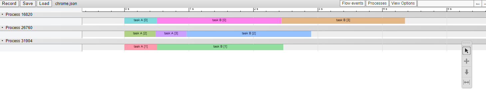

## Handy Thread Pool
Thread Pooling is a general technique for multithreaded applications. It's not so hard to implement basic features with standard library on C++. but There are some usefull idea, that helps making simpler code.

There are some thread libraries e.g. windows ppl, intel tbb, Task flow ( https://github.com/taskflow/taskflow ) but all of these are large libraries, you might want a simple and lightweight solution.

In this repository, I will introduce you that simple but powerful techniques.

## 1.Basics
worker threads are represented by these varibles.

```
bool _continue;
std::vector<std::thread> _workers;
std::queue<Task> _tasks;
std::mutex _taskMutex;
std::condition_variable _taskCondition;
```

And we can build task consumer logic with mutex and condition_variable like this

```
for (;;)
{
    Task task;

    {
        std::unique_lock<std::mutex> lockGuard(_taskMutex);
        _taskCondition.wait(lockGuard, [this] {
            return _tasks.empty() == false || _continue == false;
        });
        if (_continue == false)
        {
            break;
        }
        if (!_tasks.empty())
        {
            task = std::move(_tasks.front());
            _tasks.pop();
        }
    }

    if (task)
    {
        _executingCount++;
        task();
        _executingCount--;
    }
}
```

Then we can add enqueueTask function. 

```
void ThreadPool::enqueueTask(Task task)
{
    {
        std::unique_lock<std::mutex> lockGuard(_taskMutex);
        _tasks.emplace(task);
    }
    _taskCondition.notify_one();
}
```

Finally, we can write 8 concurrent tasks with this.

```
int main() {
	pr::ThreadPool threadPool(8);

	for (int i = 0; i < 8; ++i)
	{
		int seed = i;
		threadPool.enqueueTask([seed]() {
			std::mt19937 engine(seed);
			std::uniform_real_distribution<double> d(0.0, 1.0);
			int n = 10000000;
			int nInside = 0;
			for (int i = 0; i < n; ++i)
			{
				double x = d(engine);
				double y = d(engine);
				if (x * x + y * y < 1.0)
				{
					nInside++;
				}
			}
			double pi_over_4 = (double)nInside / n;
			double pi = pi_over_4 * 4.0;
			printf("pi = %f\n", pi);
		});
	}

	std::this_thread::sleep_for(std::chrono::seconds(10));

	return 0;
}
```

## 2. Synchronization

Typically, you have to wait until the tasks finish and you don't want to use the sleep() function as the above example.

In order to implement this, I recommend task element counting, inspired by https://xyz600.hatenablog.com/entry/2019/08/18/210515

```
class TaskGroup
{
public:
    TaskGroup() : _nReminedElement(0)
    {
    }
    void addElements(int64_t nElements)
    {
        _nReminedElement.fetch_add(nElements);
    }
    void doneElements(int64_t nElements)
    {
        int64_t previous = _nReminedElement.fetch_sub( nElements );
        if( previous == nElements )
        {
            _condition.notify_all();
        }
    }
    void waitForAllElementsToFinish()
    {
        std::unique_lock<std::mutex> lockGuard(_conditionMutex);
        _condition.wait(lockGuard, [this] {
            return _nReminedElement.load() == 0;
        });
    }
    bool isFinished() const
    {
        return _nReminedElement.load() == 0;
    }
private:
    std::atomic<int64_t> _nReminedElement;
    std::mutex _conditionMutex;
    std::condition_variable _condition;
};
```

Then we can wait tasks with a proper way.

```

int main() {
	pr::ThreadPool threadPool( 8 );
	pr::TaskGroup taskGroup;

	for (int i = 0; i < 8; ++i)
	{
		int seed = i;
		taskGroup.addElements(1);
		threadPool.enqueueTask([&taskGroup, seed]() {
			std::mt19937 engine(seed);
			std::uniform_real_distribution<double> d( 0.0, 1.0 );
			int n = 10000000;
			int nInside = 0;
			for( int i = 0; i < n; ++i )
			{
				double x = d(engine);
				double y = d(engine);
				if( x * x + y * y < 1.0 )
				{
					nInside++;
				}
			}
			double pi_over_4 = (double)nInside / n;
			double pi = pi_over_4 * 4.0;
			printf("pi = %f\n", pi);
			taskGroup.doneElements(1);
		});
	}
	taskGroup.waitForAllElementsToFinish();
	return 0;
}

```

Furthermore, this allows us an additional benefit. we can wait for tasks for each kind of group.

```

int main() {
	pr::ThreadPool threadPool(8);
	pr::TaskGroup taskGroupA;
	pr::TaskGroup taskGroupB;

	for(int i = 0; i < 4; ++i)
	{
		int seed = i;
		taskGroupA.addElements(1);
		threadPool.enqueueTask([&taskGroupA, seed]() {
			std::mt19937 engine(seed);
			std::uniform_real_distribution<double> d(0.0, 1.0);
			int n = 10000000;
			int nInside = 0;
			for (int i = 0; i < n; ++i)
			{
				double x = d(engine);
				double y = d(engine);
				if (x * x + y * y < 1.0)
				{
					nInside++;
				}
			}
			double pi_over_4 = (double)nInside / n;
			double pi = pi_over_4 * 4.0;
			printf("task a, pi = %f\n", pi);
			taskGroupA.doneElements(1);
		});
	}

	for( int i = 0; i < 4; ++i )
	{
		int seed = i;
		taskGroupB.addElements(1);
		threadPool.enqueueTask([&taskGroupB, seed]() {
			std::mt19937 engine(seed);
			std::uniform_real_distribution<double> d(0.0, 1.0);
			int n = 10000000 * 4;
			int nInside = 0;
			for (int i = 0; i < n; ++i)
			{
				double x = d(engine);
				double y = d(engine);
				if (x * x + y * y < 1.0)
				{
					nInside++;
				}
			}
			double pi_over_4 = (double)nInside / n;
			double pi = pi_over_4 * 4.0;
			printf("task b, pi = %f\n", pi);
			taskGroupB.doneElements(1);
		});
	}

	taskGroupA.waitForAllElementsToFinish();
	printf("done A\n");
	taskGroupB.waitForAllElementsToFinish();
	printf("done B\n");
	return 0;
}

```

## 3. Wating for other tasks
A task might want to split the work into several sub-tasks and wait the sub-tasks. But naive thread pools sometimes can have dead-lock behavior. Fortunately, there is a good way to avoid deadlock even under a fixed a few number of threads. We can achive this by implementing processTask() function, which is able to consume a task.

```

void ThreadPool::processTask()
{
    Task task;

    {
        std::unique_lock<std::mutex> lockGuard( _taskMutex );
        if( !_tasks.empty() )
        {
            task = std::move( _tasks.front() );
            _tasks.pop();
        }
    }

    if( task )
    {
        task( );
    }
    else
    {
        std::this_thread::yield();
    }
}

```

The task dependences are safely processed.

```
int main() {
	pr::ThreadPool threadPool(2);
	pr::TaskGroup taskGroup;

	taskGroup.addElements(1);
	threadPool.enqueueTask([&taskGroup, &threadPool]() {
		std::atomic<int> dones = 0;

		// 4 sub tasks.
		for( int i = 0; i < 4; ++i )
		{
			int seed = i;
			
			threadPool.enqueueTask([&taskGroup, &dones, seed]() {
				std::mt19937 engine(seed);
				std::uniform_real_distribution<double> d(0.0, 1.0);
				int n = 10000000;
				int nInside = 0;
				for (int i = 0; i < n; ++i)
				{
					double x = d(engine);
					double y = d(engine);
					if (x * x + y * y < 1.0)
					{
						nInside++;
					}
				}
				double pi_over_4 = (double)nInside / n;
				double pi = pi_over_4 * 4.0;
				printf("task a, pi = %f\n", pi);
				dones++;
			});
		}

		while( dones != 4 )
		{
			threadPool.processTask();
		}

		printf("finished\n");

		taskGroup.doneElements(1);
	});

	taskGroup.waitForAllElementsToFinish();

	return 0;
}

```

## 4. Pros to use pinned thread.
Performance measurement of multithreaded applications might have difficulties. but "pinned" threads make it simpler. because we can understand the thread behaviors easily with tracing tool e.g. chrome://tracing as the thread traces are totally consistent. Let's see the example.


```

int main() {
	pr::ThreadPool threadPool(3);
	pr::TaskGroup taskGroup;
	for (int i = 0; i < 4; ++i)
	{
		int seed = i;
		taskGroup.addElements(1);
		threadPool.enqueueTask([&taskGroup, seed]() {
			pr::ChromeTraceTimer makeTriangle(pr::ChromeTraceTimer::AddMode::Auto);
			makeTriangle.label("task A [%d]", seed);

			std::mt19937 engine(seed);
			std::uniform_real_distribution<double> d(0.0, 1.0);
			int n = 10000000;
			int nInside = 0;
			for (int i = 0; i < n; ++i)
			{
				double x = d(engine);
				double y = d(engine);
				if (x * x + y * y < 1.0)
				{
					nInside++;
				}
			}
			double pi_over_4 = (double)nInside / n;
			double pi = pi_over_4 * 4.0;
			printf("task a, pi = %f\n", pi);
			taskGroup.doneElements(1);
		});
	}

	for (int i = 0; i < 4; ++i)
	{
		int seed = i;
		taskGroup.addElements(1);
		threadPool.enqueueTask([&taskGroup, seed]() {
			pr::ChromeTraceTimer makeTriangle(pr::ChromeTraceTimer::AddMode::Auto);
			makeTriangle.label("task B [%d]", seed);

			std::mt19937 engine(seed);
			std::uniform_real_distribution<double> d(0.0, 1.0);
			int n = 10000000 * 4;
			int nInside = 0;
			for (int i = 0; i < n; ++i)
			{
				double x = d(engine);
				double y = d(engine);
				if (x * x + y * y < 1.0)
				{
					nInside++;
				}
			}
			double pi_over_4 = (double)nInside / n;
			double pi = pi_over_4 * 4.0;
			printf("task b, pi = %f\n", pi);
			taskGroup.doneElements(1);
		});
	}

	taskGroup.waitForAllElementsToFinish();

	std::ofstream ofs("chrome.json");
	ofs << pr::ChromeTraceGetTrace();
	ofs.close();

	return 0;
}

```

App thread trace : 




## Conclusion
I showed some simple techniques for thread pool. These can be implemented only with C++ standard library. These are not highly optimized but simple and powerful.


